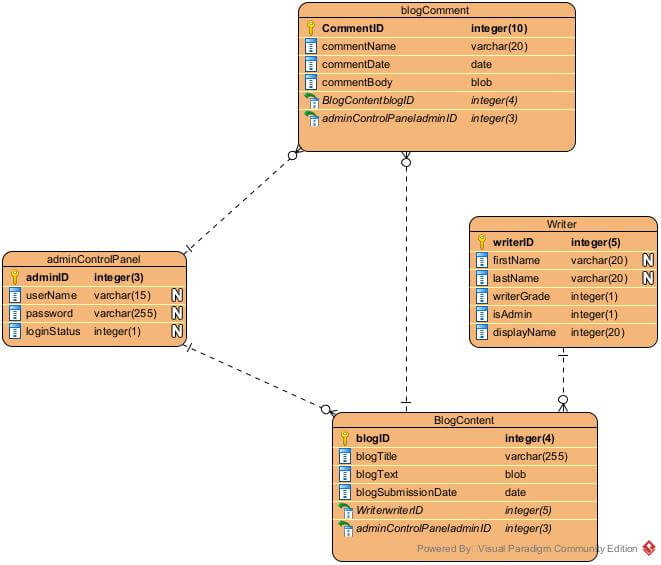

# Database schema

As the website will include a blog, a database will be used to support the Content Delivery System (CDS).  

The key items that need to be stored within the DB is somewhere to store the blog content itself, who wrote it, and when it was submitted. Tgis can allow users to search for specific blog entries.

There will also be a free format comment box for each blog, this will allow some free format user generated data to be added to the website. To ensure there is some control, an admin user would have access to both the blogs themselves, as well as any comments to protect the integrity of the website

As this will be user facing content, there is a requirement to make sure all data fields are sanitized before being submitted to the database