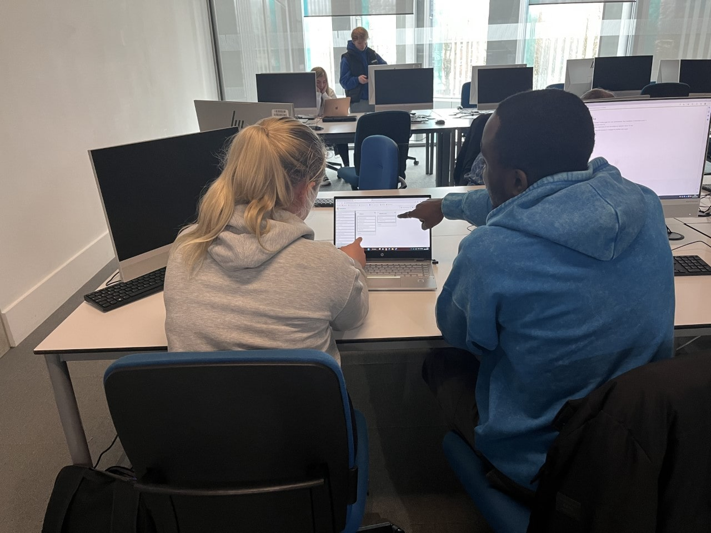
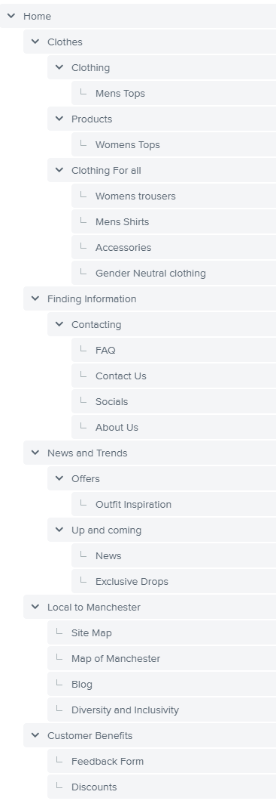
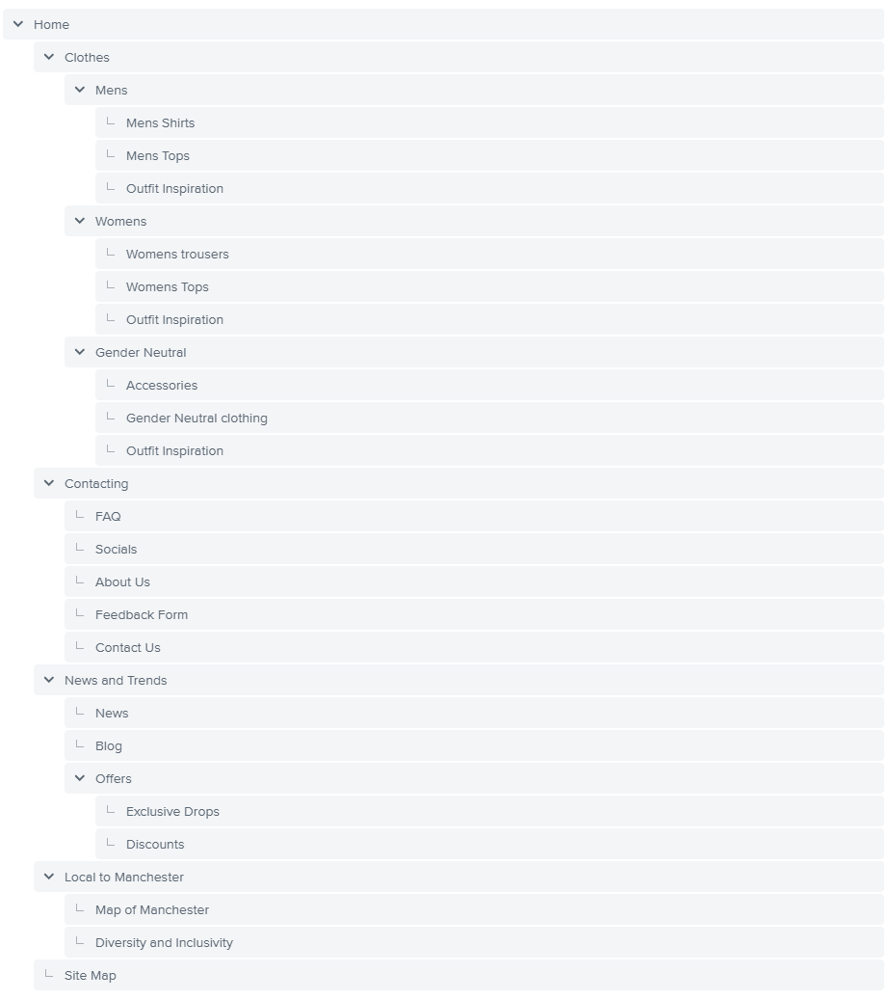
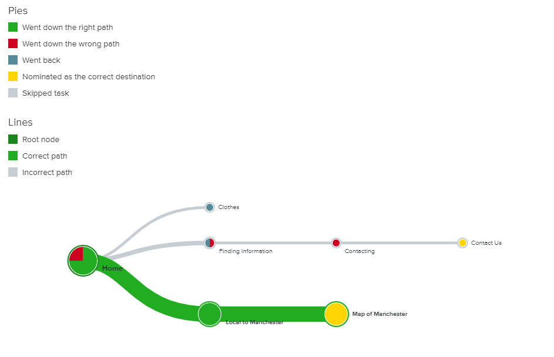
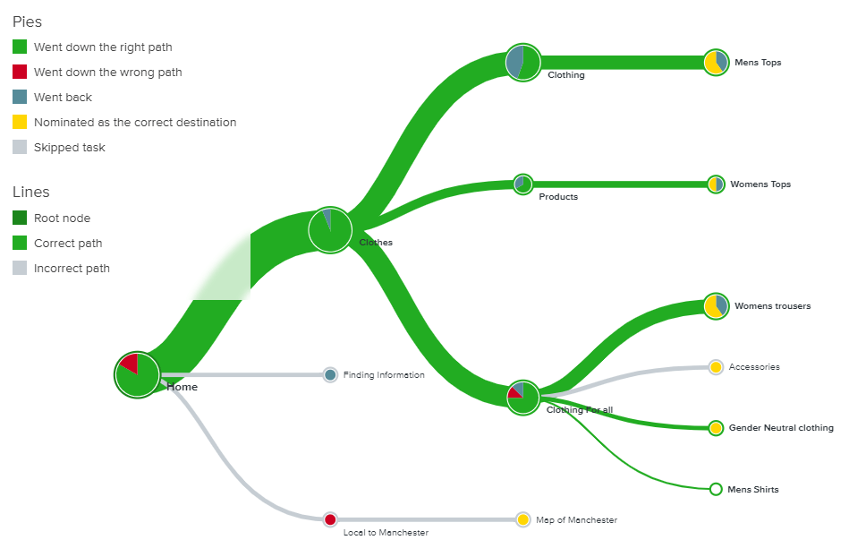
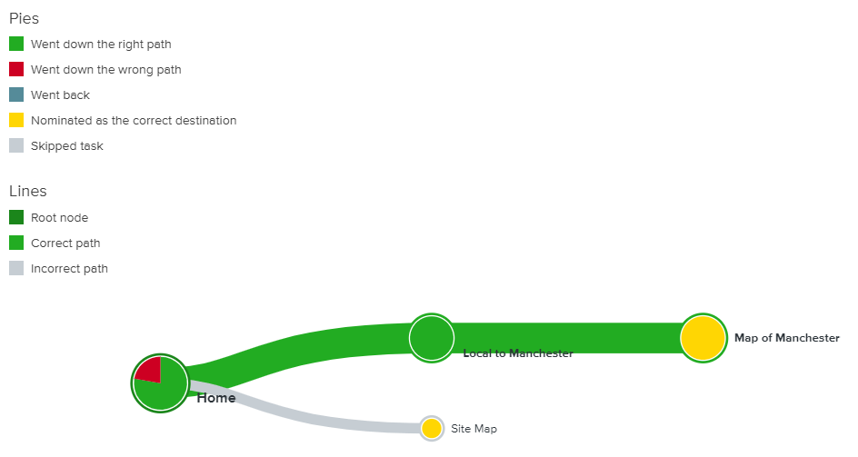
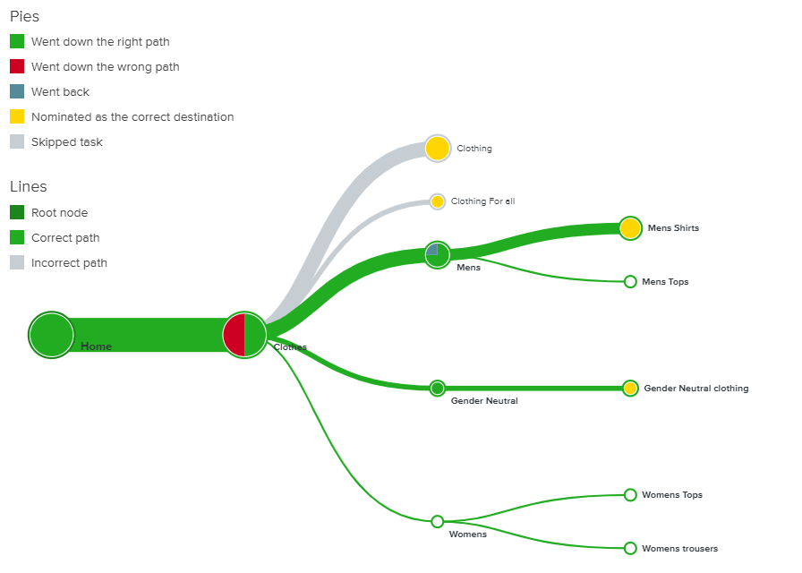
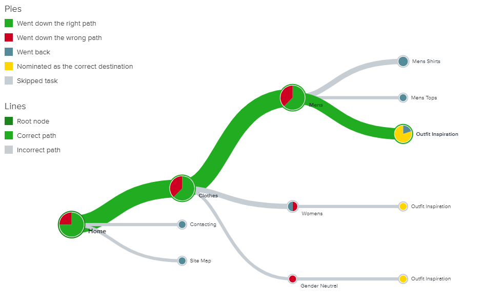

# Information Architecture Report

**Word count** 800 words maximum

## Card sort

### Introduction

Card Sorting is a technique used categorising and understanding information. It is a relaible technique which allows us to further enhance the designing process. 

In order to build a fully functional and efficient website, we decided to use the Open Card sort approach to plan what would help create an intuitive and fluid user experience. The Open Card Sort method, consisted of sorting a number of cards into categories that made sense to our tester group. This enabled us to understand how clients would intuitivley us our website and how they would search for infomration. The open card method also allowed our tester group the flexibility to name each catagory. This approach allowed us to explore numerous catagory options and due to our tester group being Manchester natives, we were able to explore catagory names that resinated with the Manchester culture.

We tasked our tester group with quickly sorting each card, which related to fashion and the Manchester Culture, into various catagories. We gave them a short time frame of 3 minutes to do this so we could understand how they would naturally navigate a website and not giving them enough time to think about the catagories too much. Once the tester group had completed their card sort, we collated the results of the workshop. We reviewed the catagories each individual had picked and explored the different trends and any common themes that repeatedly came up. This helped us to understand our target audience more and allowed us to decided the best catagoristation to use for our website. 

Illustrated account of your process. The below image shows two of our test group users completing the card sord on the software we were using to complete the activity. 

_Insert images/illustrations using `` including photographic evidence of the testing sessions_.

### List of the card elements

- Womens tops
- Womens Trousers
- Mens Tops
- Mens Trousers 
- Gender Neutral 
- Diversity and inclusion 
- Blog
- News
- About Us
- Accessories 
- Contact Us
- FAQ
- Feedback Form 
- Site Map 
- Outfit Inspiration
- Map of Manchester 
- Discounts 
- Socials 
- Exclusive drops 
- Home Page .

### Cart sort results

After we completed the open- card sort, results showed that we had 3 similar groups awith similar labels within. The first main group was 'Clothes', which held similar group labels such as 'Clothing', 'Products' and 'Clothing for all'. The second main group was 'Finding Information' which contained group labels such as 'Home' and 'Contacting'. The third main group was 'News and Trends' which held group labels such as 'Offers' and 'up and coming'. Other common groups identified included 'local to Manchester' and 'Customer Benefits'. These results show the ways individuals link different headings for our guide/ website and helps us to understand how we may structure the site to make it the most efficient and easy to use. By grouping items together under associated group labels, it makes it easier for the site users to find the information they require.

## Tree testing

### Introduction

Using the strongest correlation of data from the Card Sort, we initially created a Tree Diagram using the data as it came, without making any modifications. We did find that while some of the generated categories did make sense, there were some other questionnable choices. However to allow our users to provide feedback on the basis that we would complete multiple Tree Tests.

### Illustration of the architecture tested

#### Tree Test Arch 1

The two tasks we asked users to complete were:

- Find the Map of Manchester
- Find all clothing sections

#### Tree Test Arch 2

The two tasks we asked users to complete were:

- Find the Map of Manchester
- Find all clothing sections

#### Tree Test Arch 3

The two tasks we asked users to complete were:

- Find Mens Outfit Inspirations
- Find News

### Tree testing results

#### Tree Test 1
We were able to confirm that the first Tree Test did require additional work before it could be used as a sensible site plan. While there was a 90% success rate at finding the Map of Manchester, some users did have to look into other categories. 1 user failed to find the map, however we believe this is an outlier. The clothing sections however were found to require too many clicks. 80% of users were able to find at least one of the tasks, however they did have to look into a number of categories to find them. As a result, the Tree Test was simplified, and a second architecture was created.

##### Task 1 - Find the Map of Manchester

##### Task 2 - Find all Clothing Sections

#### Tree Test 2
9 users participated in the second Tree Test. 78% of users were able to successfuly complete task 1. We think this is due to users not being used to seeing a "Site Map" included within the structure. So when we asked them to find a "Map of Manchester", they selected the wrong option. This highlights removing the Site Map away from the main navigation pane. The second question demonstrate the need to ensure that Tree Tests need to be carefully constructed. 56% of users failed to find the correct pages within the structure. This is as there were duplicate pages that did not go to where the user was expecting. The view withing the team is to ensure that the next iteration of the architecture removes the ambiguity to make it easier for the user.

##### Task 1 - Find the Map of Manchester

##### Task 2

#### Tree Test 3
Only 6 users interacted with the final Tree Test. The first question they were asked was to find "Mens Outfit Inspirations." 4 of the users was able to find the page correctly, however one of the users did go to the right category, but then moved to the "Gender Neutral" section. This highlights that we could include all Mens and Womens inspiration suggestions together as well. As there was no imagery attached to the links, it may have helped users identify the right area. The second question asked users to find the "News" section. 5 users managed to find this section correctly.

##### Task 1 - Find Mens Outfit Inspirations

##### Task 2 - Find News

Following the Tree Tests, the proposed next steps is to use Tree Test 3 as the baseline for the initial Site Map.

---
