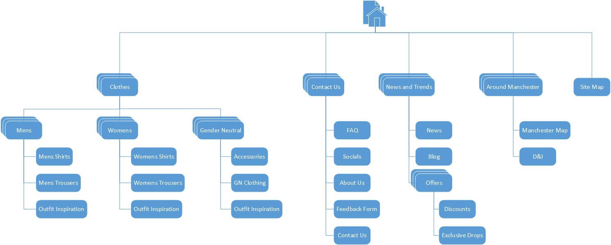

# Site Plan

Add your initial site plan for SP2, and any further revisions for SP5. Include commentary.

## Original Site Plan

### Commentary

The Site Plan Architecture has been pulled together following the success of the final iteration of the Tree Test. The group is comfortable that this details included are a good fit for the inital website. The ordering is not currently set in stone for the order of the menu items, however this will be reviewed during detailed Website Designs

---

>We would expect at least one further iteration, but don't adjust them for the sake of it. Your final version must reflect the architecture of the site (The Guide) that you submit at SP5.

## Site Plan v2

### Commentary
Detail your revisions. If it helps, highlight the changes on the site plan itself.

---

## Site Plan v3

### Commentary
Detail your revisions. If it helps, highlight the changes on the site plan itself.

