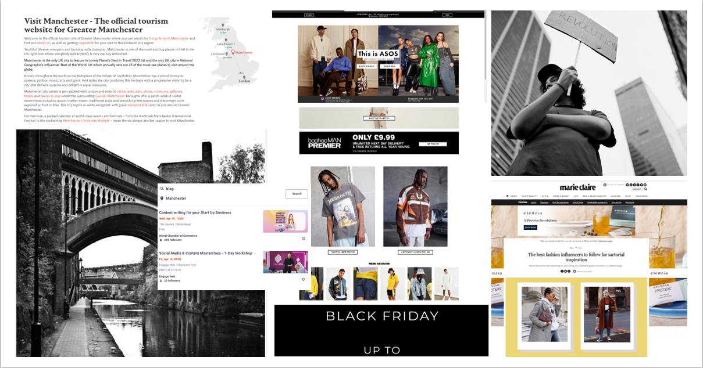
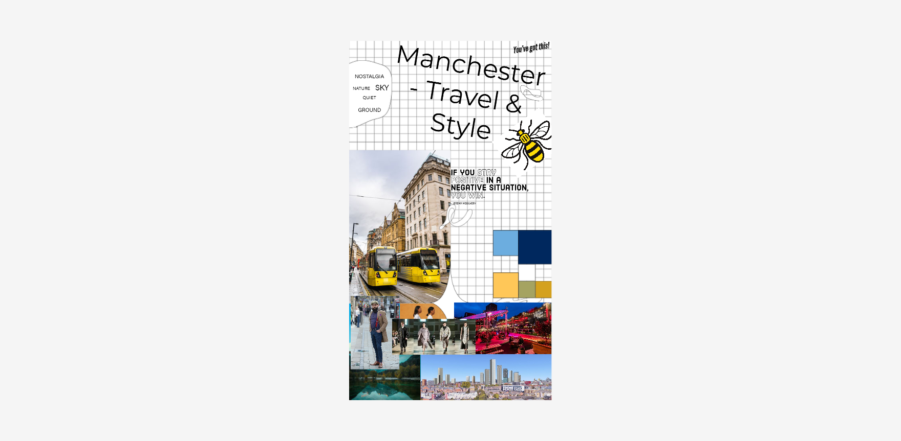
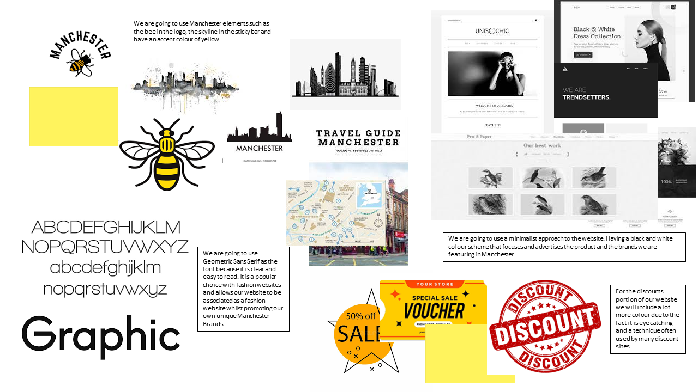

# Moodboards

Add a moodboard for each team member plus a final team moodboard.

*Tutors will download the image to view the full size persona*.

<!-- edit as required -->

## Moodboard One

### Adele Le Moignan
My personal influences for this mood board include having local imaged of Manchester included on the site. I think this creates a more relatable site and it makes it clearer as to what the site is about, especially as it is specifically targeted at students in Manchester. After searching around, I gathered inspirations from looking at other websites and how them presented their sites to encourage more sales. I noticed that presenting the different style pieces together as one outfit helped to promote sales of multiple items rather than just one. I noticed this predominantly in magazines targeted to a student age range. This is something I would like to include on our site. Furthermore, many student sites I looked at had bold colours. For example, Unidays makes use of bright green colour, and so I looked at other bold colours to include such as blue and pink which could help attract students to the site and help emphasise specific parts of the site which may include discounts or deals. 

---

## Moodboard Two

### Bryan Ebune
My personal influences for this mood board are catered around imagery and colour. Imagery and colour serve as a focal point for each website as these are the first things they notice. If this is well executed, user retention is more guaranteed as vivid colour, white spacing and high-quality images are more likely to garner attention. Using images of people closer to the target audience creates some sense of reliability as they see themselves in whatever is being sold/advertised to the users. The use of simple colours like black and white keep the websites simple and easy to navigate. These are aspects which I would like to add to our website as I think it would be well received by the target audience.

---

## Moodboard Three

### Lucy Barrow

My Personal influences and inspirations for this mood board involve having branding that resonates with the culture of Manchester. I believe it is important to incorporate Manchester icons, such as the bee, and Manchester colour schemes such as yellow and dark red. However, I am aware that we are trying to promote a product and we are a site that hosts numerous brands, each with their own unique branding. Therefore, I believe it is important to make the branding minimalist to allow for the individual local brands to shine. I noticed that this was a technique used by many big fashion brands, who pick an accent colour and a easy to read font that showcases the product itself. This is where I have drawn inspiration on my mood board, which has explored Manchester branding, common colour schemes, typography and what is the common branding trends for fashion websites. I believe the best approach for our websites branding would be to have small Manchester specific elements whilst using an overall minimalistic theme to allow us to create a website that is easy to navigate and looks appealing to students.

---

## Moodboard Four

### Name of team member
My inspiration for this moodboard is related to what is going on in Manchester now with the trams through the city centre. This lines up with the Manchester Bee colour scheme of black and yellow. Manchester has a number of different colour swaths, lining up with  different sports clubs. The colours are bold

---

## Team Moodboard

### Team mood board final decisions 

As a team, we decided we liked elements from each mood board. We believe a minimalist approach, similar to Bryan's mood board, was the best approach for the majority of the site. However, to make it feel like a Manchester site we are going to incorporate elements such as the bee, the colour yellow as an accent colour, and the Manchester skyline in the header of the website, so the site resonates with our target audience. Moreover, we have decided to go with Geometric Sans Serif as a font as it is easy to read, commonly used in fashion websites, and allows for the clients focus to be on the content of the site and not the style of the written words. Furthermore, we decided that our discounts section would include more colour and splashes of yellow to show that this is an exciting part of the website. We believe adding colour to this part of the site will make it more engaging for our clients and show that this is a great part of the website.

---
