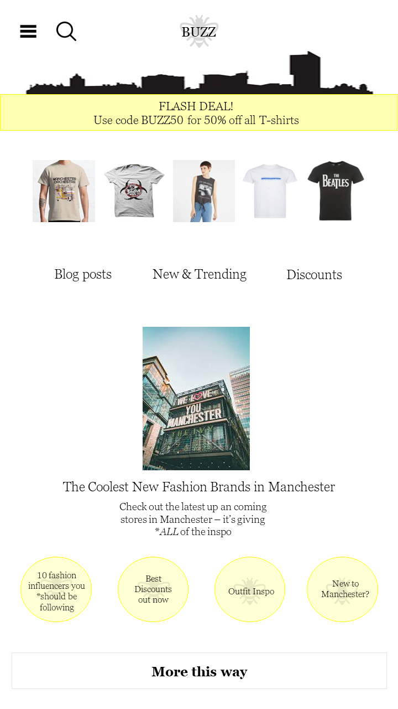
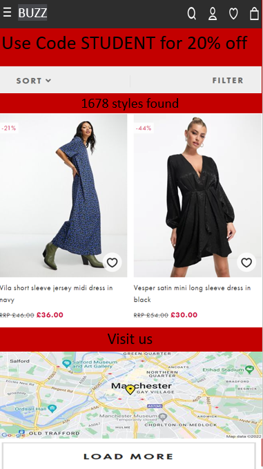
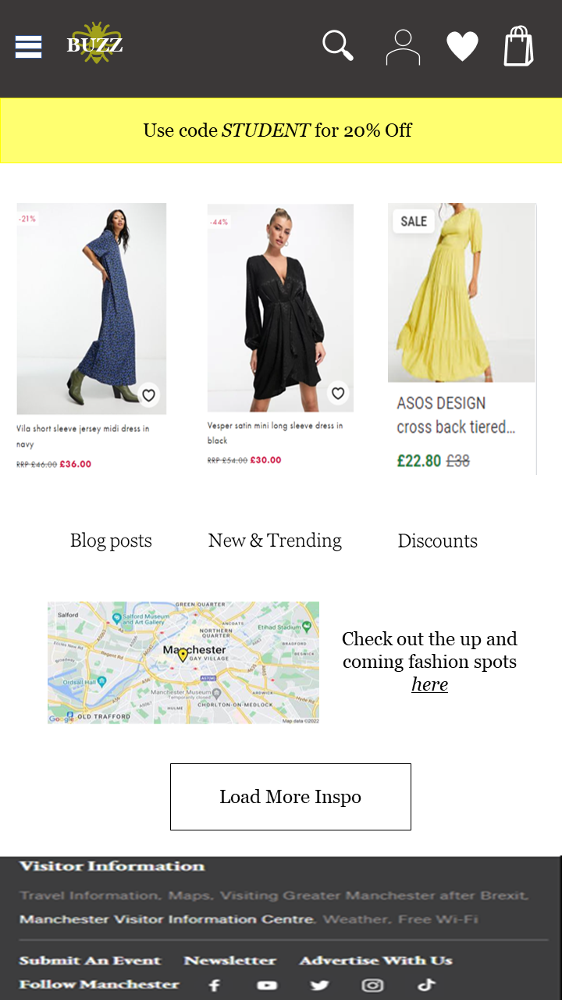

# Design process and high fidelity page mock up

As a team we each created a page design independently , and when finished we discussed our ideas with one another. By borrowing each others ideas, we were able to come up with our final design which we believe to be the best solution. 

The following designs are Low-fi designs that we created on pen and paper. We designed them as if they were on a mobile first and included colour ideas, layout, typography, space, form and considered usability and accessibility. 

Pen and Paper design 1 (Bryan Ebune): 

 

Pen and Paper design 2 (Lucy Barrow): 

 

Pen and Paper design 3 (Adele Le Moignan): 

 

Pen and Paper design 4 (Matt Tweedy): 

 

You should add evidence of your group’s design process here. Begin with artefacts created by the whole team, then the high fidelity mockup.

## Group Artefacts

After we initially created our designs on pen and paper, we moved to a web based platform to create a more realistic design. We were able to consider the layout and space, as well as using colours and fonts specifically mentioned in our style guide. 

Mock up design 1 (Bryan Ebune): 

 

Mock up design 2 (Lucy Barrow): 

 

Mock up design 3 (Adele Le Moignan): 

 

Mock up design 4 (Matt Tweedy): 

 

## High Fidelity mock-up

This is our final design which encourporates ideas from each member of the group which has resulted in a higher quality site. 

 

