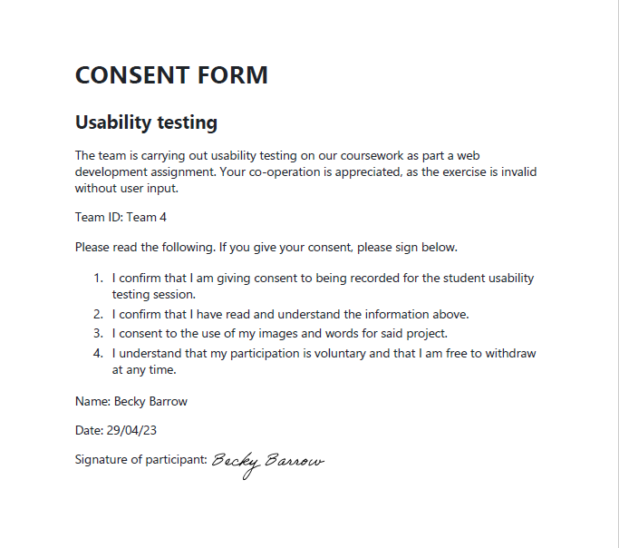
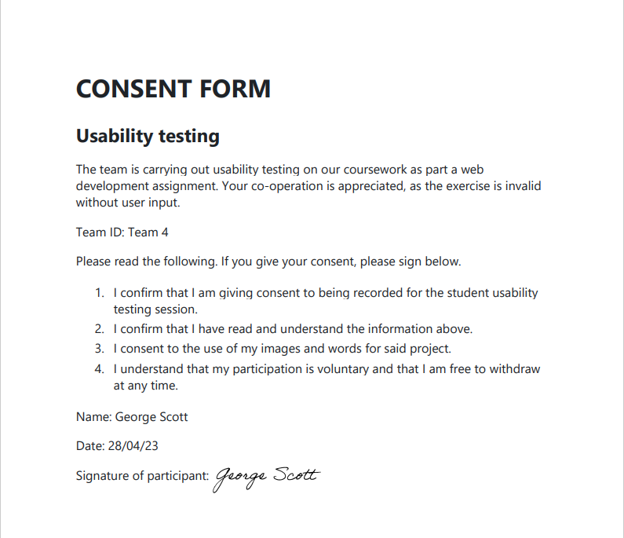

# CONSENT FORM

## Usability testing

## External Consent form - particpent asked to sign form prior to completing User testing

## Internal Consent form - particpent asked to sign form prior to completing User testing

