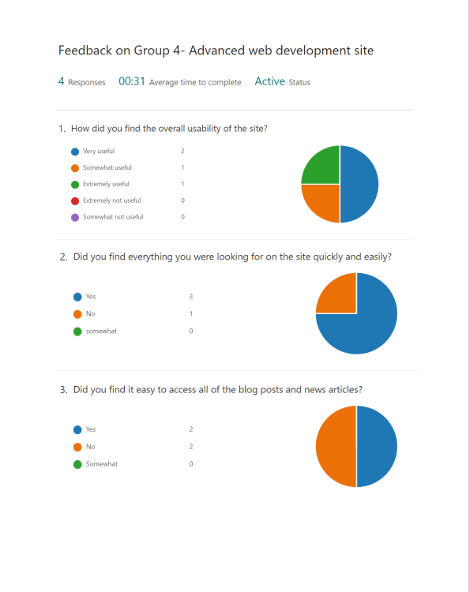
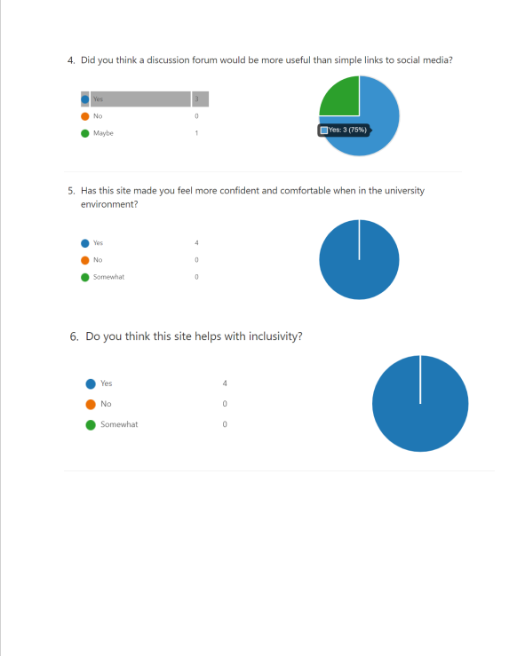

# Usability Testing Report

## Introduction

Write an introduction to your report.

1. What did you do?
2. Why did you do it?
3. How did you do it?

### Findings

(500 words)

Discuss the key issues that have been identified (positive and negative). This must closely relate to your observations (in your notes) and any exit surveys.

4. What did you find?

## Actions

Detail the changes your group has decided on in response to the initial testing and any subsequent test sessions.

Create an updated version of the page design and add this to the report.

## Results of further testing

Any further testing should be evidenced (photographs, notes and actions). Tutors will not just accept _we did some more testing_.

<!-- ## Notes

> Download -[Mini User Journey](sp4-media/mini-user-journey.pdf) forms.

Scan your completed notes as a single pdf, add to the sp4-media folder and link above. -->

## Exit survey

Below are the results from our exit survey. We conducted this survey after userabilty testing and consolidated the results into the below tables. 

## Consent form(s)

Below are our signed consent forms. These can also be found in SP4 Media folder. These where signed prior to conducting user testing. 

## External Consent form - 

## Internal Consent Form - 

Scan your completed consent form(s) as a single pdf, add to the sp4-media folder and link above.

---
