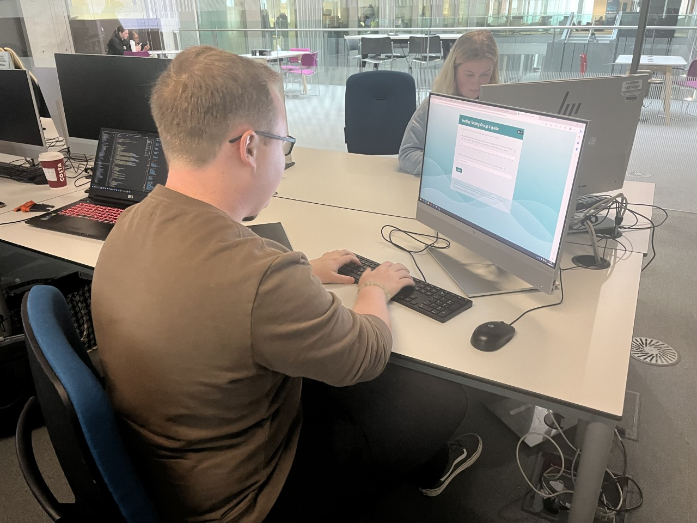
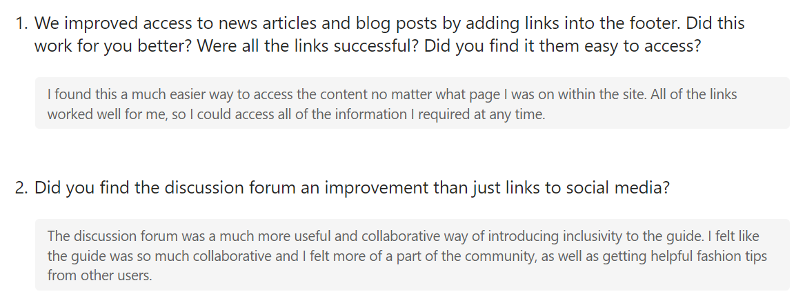
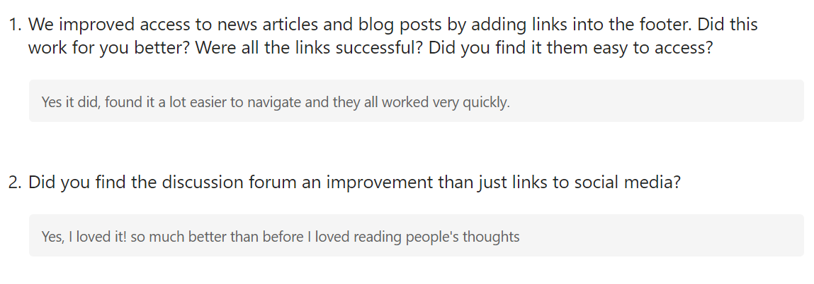

# Usability Testing Report

## Introduction

Write an introduction to your report.

1. What did you do?
   
We conducted our inital useability testing by asking an internal and external particpant to review the site. Prior to conducting the testing we got both parties to sign individual consent forms to ensure we had their permission to progress with useability testing. We then asked them to explore the site, like they would if they were to browse any other website. We watched and made notes of any comments that were made and of the paths to find certain information they took. We also set the users with small tasks such as, find mens clothing, find the about us information and find girls clothing. This allowed us to understand the exact steps a user would take and allowed us to understand whether we have set the paths up to make the most sense for users. By allowing users free reign over the site and also setting specific tasks they needed to complete, we were able to gain valuable data that we can use to make ammendments to are orgianl site. 

2. Why did you do it?

We conducted useability testing to ensure users, both external and internal, could understand and use the site. It also highlighted any issues or bugs we had with the site, which we were able to fix prior to submitting the portfolio work. The valuable insight we gained from conducting this task allowed us to produce a better product that met the needs of our users. 

3. How did you do it?

We selected two candidates that would find this site useful and watched as they interacted with the site. We made a note of any comments they had, such as on the font or the colours used. We then set them specific tasks to complete and watched how they interacted with the site using their own logic. This helped us to understand whether are paths were logical or needed ammending. We then used the findings to make ammendments to are site before conducting further useability testing to ensure are site was the best it could be. 

### Findings

The findings from the useability testing highlighted that those tested enjoyed the content, colours and font and found the content enjoyable and helpful. This provided the group with the confidence needed in the site as it verified that our design choices were well received with our target audience. The content used was enjoyed by both user parties and both made comments on how helpful it was and that they are looking forward to using the exclusive discount codes to shop at their favourite Manchester stores. 

Some Negative comments were logged, and they proved helpful with allowing us to understand how we could further improve the site. They made comments on the accessibility to links and the file paths and asked for these to be made more easily available. Furthermore, they requested improvements in the discussion forum, as they enjoyed the idea but want topics and information posted in this forum to be more visible. This information was captured in detail in our exit survey and further recommendations and is something we are actively looking to improve. 

The discussion forum was an idea born later in the development process and its capabilities were limited when we came to testing it with our external and internal users. We found the process of useability testing vital in highlighting that this is an element our users want and are actively looking to introduce this to a good standard prior to going live with our site. However, the changes required to the code to make this an interactive section are challenging and we have found that time constraints have added an element of pressure to delivering this. However, we have as a group recognised the forums significance as it is an important part of our site that could provide a space for individuals to talk with one another and express themselves creatively through fashion and the median of discussion.  

Furthermore, comments over paths to find information were made with our test users stating that certain pathways are not that visible, and they would appreciate them being made more easily accessible. We took this information and made sure to implement the necessary changes to ensure they became more visible. These where retested in further user testing conducted and we found a much more positive response to our new pathways to find information. 

Overall, the experience of user testing was incredibly helpful for the group. We found the insights into how users would interact with our site vital and were able to action certain comments made to make improvements to the site. Moreover, the positive comments made also proved helpful as they highlighted that people enjoyed our content and design and that both were well received by our target audiences. Once we conducted further user testing, we were given the confidence we needed to know that our site was fit for purpose and would be used by our target audience in the future. 

## Actions

As a group we decided that implementing a fully functioning, fit for purpose discussion forum would be challenging under the current time constraints and limited capabilities of the team. Therefore, we made the executive decision to forgo implementing major improvements to this section and instead focused on improving the pathways and making it easier for individuals to find information on our site. 

After we implemented these changes, we conducted further user testing and found we had a much more positive response to our changes. We asked the same individuals who originally conducted our user testing to return and provide comments and the improved site. Users commented that the changes made to pathways and accessibility to information massively improved and their experience with the site was far more enjoyable. By conducting further user testing we were able to see whether are changes had improved user experience with the site. By confirming this was the case, we were able to feel confident with our new and improved website prior to submission.

Create an updated version of the page design and add this to the report.

## Results of further testing

Image of Further testing conducted with the same individual who interacted with our inital user testing 

Below are further responses we collected after improving some of the aspects that were highlighted to us in the user testing, such as the addition of a discussion forum and the addition of links to the footer. These surveys were filled out by the individuals who tested our site origionally. 

## Further Testing: Becky Barrow

## Further Testing: George Scott

## Exit survey

Below are the results from our exit survey. We conducted this survey after userabilty testing and consolidated the results into the below tables. 

## Consent form(s)

Below are our signed consent forms. These can also be found in SP4 Media folder. These where signed prior to conducting user testing. 

## External Consent form - 

## Internal Consent Form - 

---
