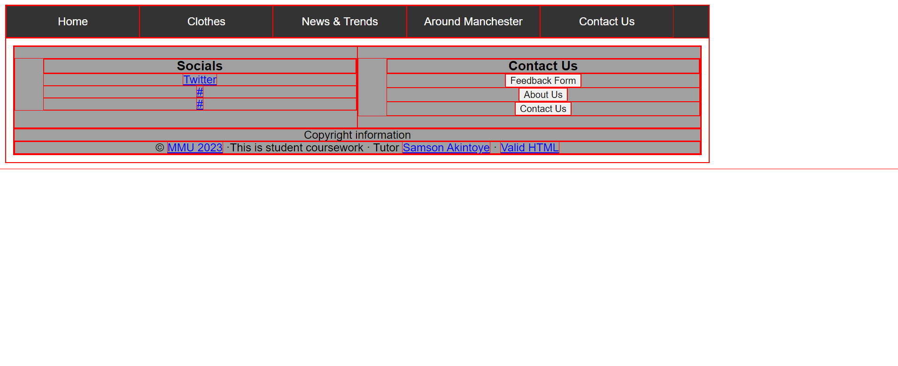
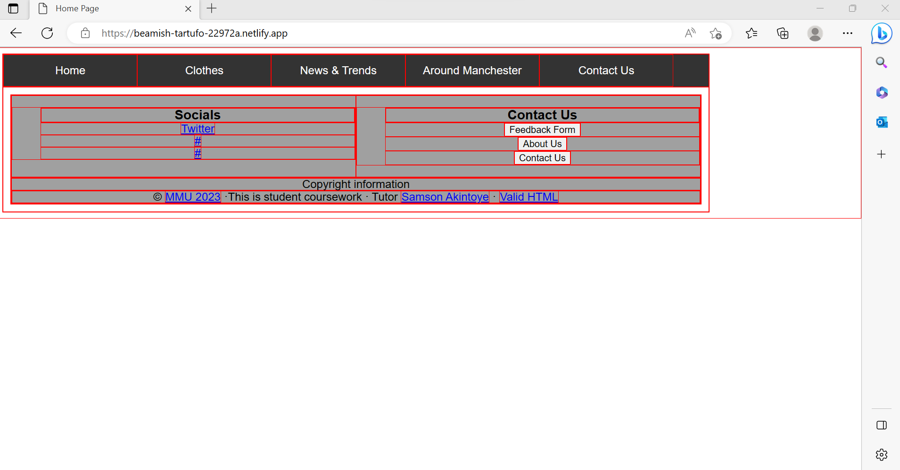
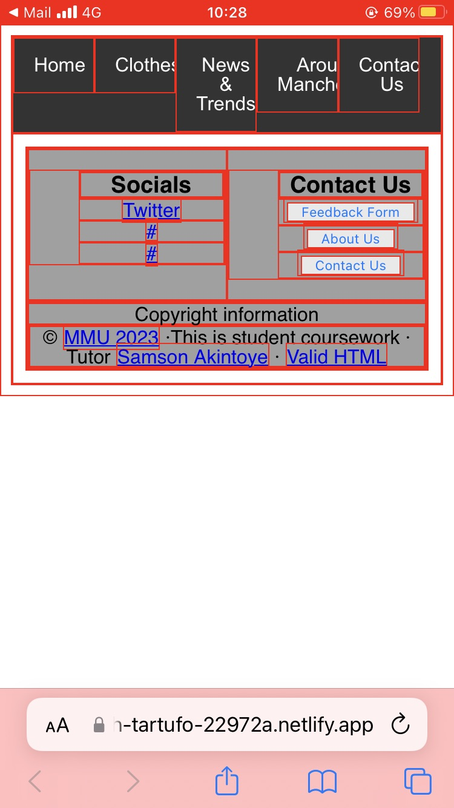

# Browser Testing

<!-- edit as required -->

## Desktop

### Google Chrome

### Notes

The main issues that arose after testing our webpage in google chrome was that the page was not evenly spread out enought to fill the device in which it was presented on. As you can see above, when the website was displayed in google chrome it was all situated in the top left corner of the page. This creates a very uninspiring page, and the lack of pictures or any form of imagery further contributes to this. However, the page is fully functional and all of the links to the different areas of the site work well.

### Google Chrome Fix 
We revisited the CSS on this site to try and improve it for the browser of google chrome. We managed to add pictures to the page to make it more engaging and interactive for users of the site. Furthermore, after fixing the code the page now displays perfectly on a computer screen, and fills the page rather than being bunched in the top left corner of the screen. This makes it much more usable. 

### Microsoft Edge 

### Notes
Similary to google chrome, the main home page of our site is presented in the top left corner of the page. Again this means that all of the text is bunched together and makes it difficult to create an engaging and usable site. However, again all of the links worked perfectly, which encourages users to use other pages of the site.

---

## Mobile

### Mac IOS - Safari

### Notes
Similar to the web browsers, the majority of site content for the webpage was bunched up at the top of the page for apple. This is clearly a consistent issue in the CSS of the site. 

### Mac IOS- Safari Updated 

### Notes
After adjusting the CSS for the webpage and adding some imagery, the home page content is now displayed evernly across the phone screen and browser. 

### Android

Much like all of the other browsers and devices, the site content was presented at the top of the page and was bunched up. By fixing the CSS for the webpage, this should solve all of these issues. 

### Notes
After adjusting the CSS for the webpage and adding some imagery, the home page content is now displayed evernly across the phone screen and browser. 

### Android Updated

### Notes 
After adjusting the CSS for the webpage and adding some imagery, the home page content is now displayed evernly across the phone screen and browser. 

---
