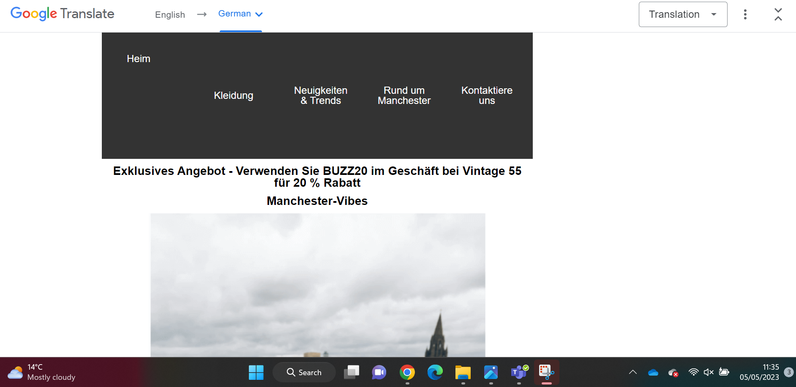
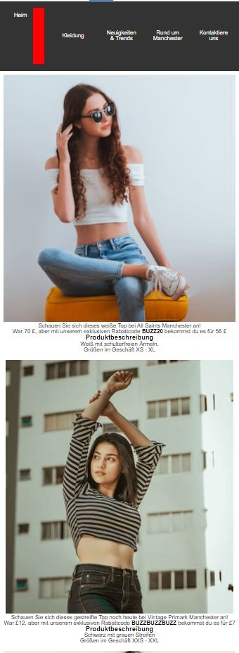
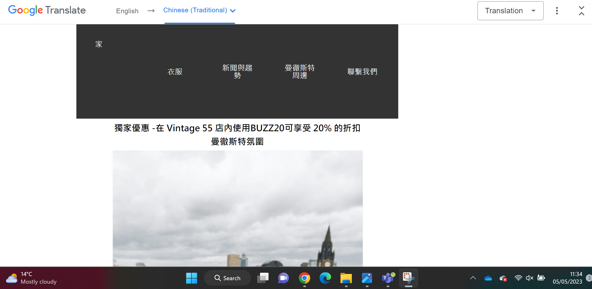
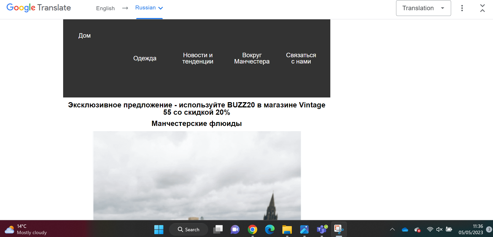

# Internationalisation

<!-- edit as required -->

## Language One- German 

## Home Page 

## Inner Page 

### Notes
Translation into German has caused no major issues regarding presentation of our webpage. All of the text is either situated in the same area, or if the word is slightly longer in the german language in comparison to english, the text splits perfectly in the same area it is presented. However, on the translation of the page, some of our English slang words have not been picked up and translated by Google Translate. For example, 'Vibes' has not been translated, and 'BUZZ20' our discount code has not been translated. Although this may cause no major issues as a discount code should be universal if being used, a different language of discount code would not be authorsided. Furthermore, the german language may simply not have a translation of the word 'Vibes' and so there may be no alternative option and it may be best left in English.  

## Language Two- Chinese

## Home Page

## Inner Page 

### Notes
Provide a description of any issues. If the issue has to be corrected add another screenshot to show the fix.

---

## Language Three- Russian

## Home Page

## Inner Page 

### Notes
Provide a description of any issues. If the issue has to be corrected add another screenshot to show the fix.

---
